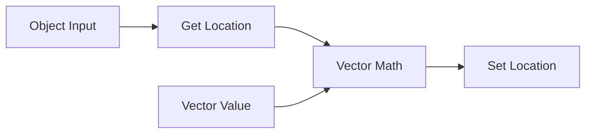

Scene Graph Nodes is a Blender add-on for building scene-level node graphs. It lets you connect objects, transforms, matrices, attributes, groups, and debug values in Blender's standard Node Editor.

  Add-on version 0.1.0
  English + Japanese
  Node pages split by category

## What this documents

- How to install the add-on for development.
- How evaluation flows through a Scene Graph node tree.
- How dynamic object and mesh attributes are exposed.
- Every currently implemented node, with one page per node.
- How documentation should be updated for every add-on release.

Start with [Installation](./installation.md), then try the [Quick Start](./quick-start.md).
