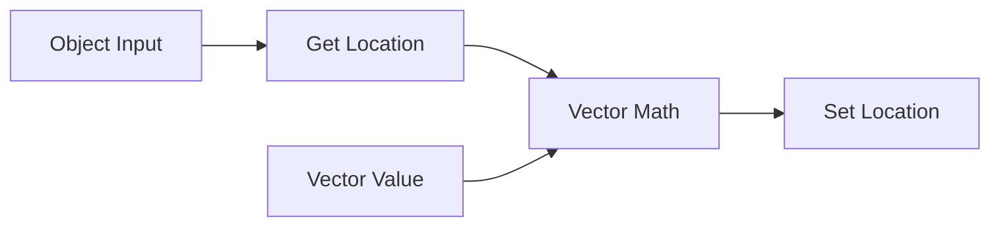

Scene Graph Nodes は、Blender の標準 Node Editor 上でシーンレベルのノードグラフを作るためのアドオンです。オブジェクト、Transform、Matrix、Attribute、Group、Debug 値を接続して評価できます。

  アドオン version 0.1.0
  英語 + 日本語
  ノード別ページ構成

## このドキュメントの内容

- 開発用インストール方法。
- Scene Graph node tree の評価の流れ。
- Object / Mesh の動的属性ソケット。
- 実装済みノードの個別リファレンス。
- リリースごとのドキュメント更新手順。

まずは [Installation](./installation.md) と [Quick Start](./quick-start.md) から始めてください。
